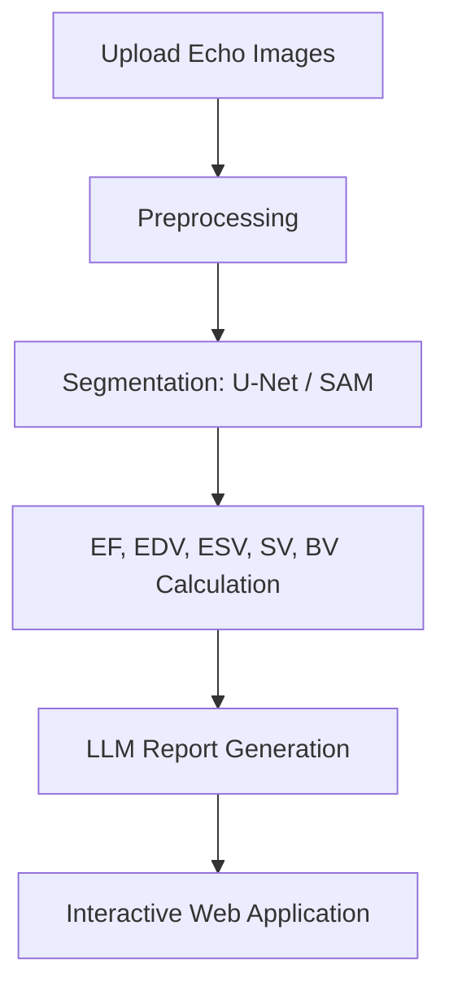

# End-to-End Echocardiographic Analysis Pipeline  
**AI-Powered Assessment and Reporting of Heart Function**

---

## Overview

Cardiovascular diseases (CVDs) are the leading cause of death globally, and echocardiography is a key diagnostic tool. However, manual interpretation is complex, time-intensive, and requires expert cardiologists. This project presents an **AI-powered end-to-end echocardiographic analysis pipeline** that automates cardiac structure segmentation, clinical parameter estimation, and structured report generation, all through a web application.

Our system supports supervised (U-Net) and self-supervised (SAM, MedSAM) segmentation models, ejection fraction estimation using the Area-Length method, and report generation with Large Language Models (LLMs), integrated into a full-stack web platform to help cardiologists in automating and analyzing the echocardiographic workflow.

---

## Project Summary Video

A 3-minute overview of the project including the goal, proposed solution and community impact.

[](https://www.youtube.com/watch?v=ySWKCKW3JVc) 

▶️ **[Click here to watch the demo](https://www.youtube.com/watch?v=ySWKCKW3JVc)**

---

## Demo

https://github.com/user-attachments/assets/ee0f611e-41d3-499a-9ed3-3c751f92d0cf

---

## Features

- **AI-Based Cardiac Segmentation** (LV Endo, LV Epi, LA)
- **Clinical Parameter Estimation**: EF, EDV, ESV, SV, BV
- **Automated Report Generation** with LLMs
- **Web App**: Upload, visualize, edit, and export reports
- **Authentication & Cloud Storage** via AWS
- **Manual Report Editing** before export

---

## System Architecture



---

## Repository Structure

```
End-to-End-Echocardiographic-Analysis-Pipeline/
│
├── CAMUS/                          
│   ├── Dataset/                    
│   ├── Preprocessing/                    
│   └── Model/                      
│       └── U-Net/                  
│       ├── SAM/                    
│       └── MedSAM/                    
│
├── EchoNet_Dynamic/    
│
├── webapp/                        
│   ├── AI_Connection/                 
│   ├── EchoAnalysis-BE/              
│   └── EchoAnalysis-FE/              
│
├── .gitattributes
│
└── README.md                     
```

---

## Methodology

- **Segmentation**:
  - *Supervised*: U-Net from scratch & pre-trained ConvNeXt U-Net
  - *Self-Supervised*: Zero-shot and fine-tuned SAM/MedSAM
- **Parameter Estimation**:
  - Area-Length Method using A4C view
- **Report Generation**:
  - Clinical impressions generated using Gemini 2.5 Flash LLM
  - Evaluated using SBERT semantic similarity
- **Web Integration**:
  - Frontend: Angular + Tailwind CSS
  - Backend: Node.js + FastAPI + MySQL + AWS S3

---

## Results

| Task                  | Best Method         | Metric       | Score |
|-----------------------|---------------------|--------------|-------|
| LV Endo Segmentation  | Pre-trained U-Net   | Dice @ ED    | 0.95  |
| LV Epi Segmentation   | Pre-trained U-Net   | Dice @ ED    | 0.89  |
| LV Endo (SAM fine-tune) | Fine-tuned SAM    | Dice          | 0.86  |
| EchoNet Generalization | U-Net (zero-shot)  | Dice         | 0.87  |
| EF Estimation Accuracy | Area-Length        | MAE ±10%     | 80%   |
| Report Generation     | Gemini 2.5 Flash    | SBERT Score  | 0.67  |

---

## Datasets

- **CAMUS** – Cardiac 2D echocardiographic dataset  
- **EchoNet-Dynamic** – 10,030 labeled apical 4-chamber echo videos  

---

## Deployment Instructions

1. Clone the repository:
```bash
git clone https://github.com/sarah1ibrahim/End-to-End-Echocardiographic-Analysis-Pipeline
cd End-to-End-Echocardiographic-Analysis-Pipeline
```

2. Install requirements:
```bash
pip install -r requirements.txt
```

3. Run segmentation or web server:
```bash
python CAMUS/Model/U-Net/segment.py
cd webapp && python app.py
```

---

## Project Report & Resources

| Resource | Link |
|---------|------|
| 📘 Full Report | [End-to-End Echocardiographic Analysis Pipeline.pdf](https://github.com/user-attachments/files/21195165/End-to-End.Echocardiographic.Analysis.Pipeline.pdf) |
| 📊 Slides | [Project Presentation](https://drive.google.com/drive/folders/1lKlK_Hux6uNpz4t7g0Fd8yC8WtnE2CUH?usp=sharing) |
| 🎬 Project Video | [YouTube](https://www.youtube.com/watch?v=ySWKCKW3JVc) |
| 🔗 GitHub Repo | [View Repository](https://github.com/sarah1ibrahim/End-to-End-Echocardiographic-Analysis-Pipeline) |

---

## Contributers

<div align="center">
  
| <a href="https://github.com/RanaHany10"></a> | <a href="https://github.com/sarah1ibrahim"></a> | <a href="https://github.com/Sarah2332"></a> | <a href="https://github.com/LunaEyad"></a> | <a href="https://github.com/JasmineTJ"></a> |
|:---:|:---:|:---:|:---:|:---:|
| [Rana Hany](https://github.com/RanaHany10) | [Sarah Ibrahim](https://github.com/sarah1ibrahim) | [Sarah Mohammed](https://github.com/Sarah2332) | [Luna Eyad](https://github.com/LunaEyad) |[Yasmin Tarek](https://github.com/JasmineTJ) |

</div>
 
## Supervisors
- **Dr. Ahmed Fahmy** – Instructor in Medicine at Harvard Medical School (2019–2022)  
  & Department of Systems and Biomedical Engineering, Cairo University  

- **Dr. Tamer Basha** – Postdoctoral Research Fellow at Harvard Medical School  
  & Department of Systems and Biomedical Engineering, Cairo University

---

## License

This project is licensed under the MIT License.

---

## Acknowledgements

Special thanks are extended to Eng. Ahmed Sharshar, and
Eng. Nada Mansour for their valuable guidance and technical
assistance throughout the development of this project.

